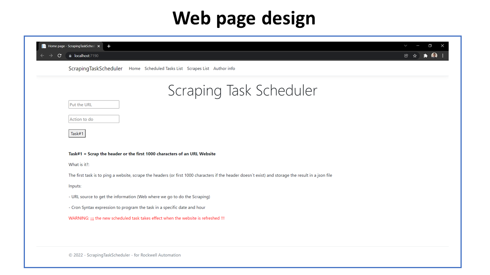

# Scraping Task Scheduler :)

## Information 

> This solution was created for Rockwell automation like part of the hiring process.

> The project was developed in Visual Studio Community 2022 version 17.0.4,
using a ASP.NET core web application with the framework .net 6.0 core (LTS)

> The project used the complements (package) "Quartz.net 3.3.3" and “ScrapyShar 3.0.0” installed through NuGet

## Author

> Created by: Hernan Hernandez (herohernan)

## User guide 

**Step #0:**

> When the web site begins or refreshes, all the scheduled tasks stored in the "./wwwroot/data/scheduledTasks.json" are launch and the scraping process start.

> You can see the "Scheduled Task List" using the link in the top of the page. Remember, to update the information, you need to refresh that page (<root>/ScheduledTasksList)

> You can see the "Scrapes List" using the link in the top of the page. Remember, to update the information, you need to refresh that page (<root>/ScrapesList)

**Step #1:**

> If you want to add a new scheduled task, you need to put a valid "url" and the "cron syntax expression" in the inputs of the "Index" page (Home), and afterwards click on the button. If one of the inputs has a wrong format, the instruction don't be loaded

> Note: The button send you to another blank page but you can close that and return to the previous main page  

> WARNING: ¡¡¡ the scheduled task takes effect when the website is refreshed !!!

**Step #2**

> Wait and see the results of the scheduled tasks using the link "<root>/ScrapesList" on the top of the web page

## API Rest

<RootPath>/api/ScheduledTasks/get 

    > get the list of Scheduled Tasks.

<RootPath>/api/ScheduledTasks/post

    > add a new Scheduled Task to the list. 
    > Warning: the scheduled task takes effect when the website is refreshed
    > Inputs: It needs a JSON body format, like the next example 
              {
                  "UrlSelected" : "https://www.efecty.com.co",
                  "CronSyntax" : "0/20 * * ? * * *"
              }
              
<RootPath>/api/ScheduledTasks/post2 

    > it's a GET api instruction that emulate a Post of new register   
    > Warning: the scheduled task takes effect when the website is refreshed
    > Inputs: It needs a query list, like the next example
              ?urlSelected=www.ejemeplo.com&cronSyntax=0 0 4 ? * * *
              
<RootPath>/api/Scraping/get 

    > get the list of Web Scrapes 